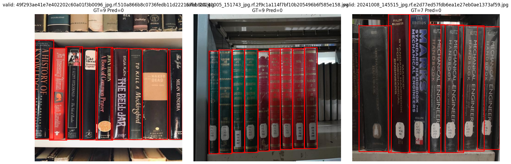
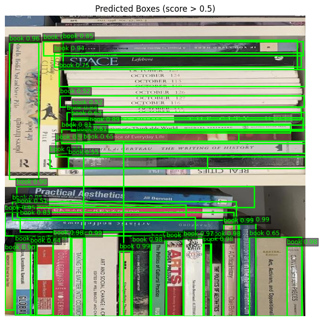

## 1. Classical (non-deep) baseline: 

classical_baseline.ipynb

## 2. CNN baseline: 

cnn_baseline.ipynb

## 3. Results + evaluation:

Book spin detection:

Classical - Book AP@0.5 on valid (IoU=0.5, score>=0.05): 0.0007 (GT=1658, imgs=96)

CNN - Book AP@0.5 (IoU=0.5, score>=0.05): 0.9321 (GT=1658)

For the classical baseline, I converted to grayscale, found the horizontal gradient magnitude, reduced to a column edge-energy profile, and found continuous high-edge vertical bands for spine detection. The model achieved very poor results, with an AP of 0.0007 using a threshold of 0.5. 

For the CNN baseline, I used Faster R-CNN and fine-tuned it on the book spin detection dataset. The model achieved very good results, with an AP of 0.9321 using a threshold of 0.05.

## 4. Failure analysis: 

### What breaks and why: 

The classical baseline performs poorly due to difficulty of finding consistent vertical bands across the variability in book spin shapes and sizes and well as lighting conditions and similar background colors.

The CNN baseline performs well due to its ability to learn complex patterns and features from the data, but may still struggle with thin book spines or occlusions.

### Failure examples:

Red bounding boxes are ground truth labels and green are predicted.

Classical:

CNN:

### Patterns:

The classical model fails to detect any spines in most images (Only ground truth labels are shown in image above). 

Small/ thin book spines are repeatly missed in the above picture for the CNN model as well as some incorrect overlapping boxes. 
