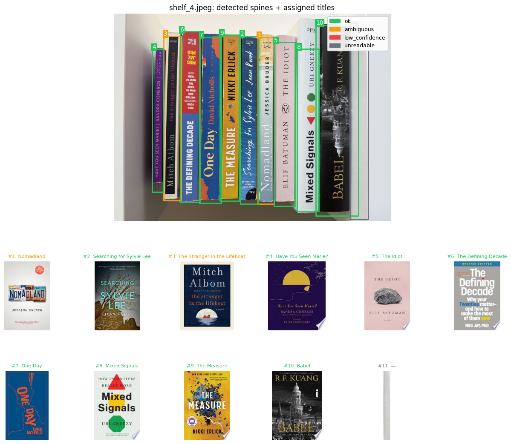

# Check-in 3

## 1. Advanced extension implementation

### Advanced methods added
Check-in 2 focused only on the object-detection stage: training and evaluating a Faster R-CNN spine detector on shelf images. Check-in 3 adds every downstream stage needed to turn detected spines into a catalog: text reading, text-based retrieval, and multimodal candidate re-ranking. As part of this I benchmarked 10 OCR backends (EasyOCR, PaddleOCR, TrOCR, TrOCR-hybrid, Florence-2, Qwen2-VL-2B, Qwen2.5-VL-3B, InternVL2.5-2B, Nanonets-OCR2-3B, and dots.ocr) on a shared set of 83 spine crops to pick the strongest reader, then assembled a full end-to-end pipeline in `catalog_pipeline.ipynb`.

### Pipeline:
1. **Faster R-CNN spine detector** (unchanged weights, ResNet18-FPN backbone) with an added **post-NMS pass at IoU = 0.30** to suppress duplicate boxes on the same physical spine.
2. **Qwen2-VL-2B-Instruct** as the OCR reader (chosen from the backend comparison above). Instead of free-form text, I prompt Qwen for a strict JSON object `{title, author, publisher, readable, confidence}`. Aspect-ratio-aware preprocessing downscales long-axis pixels so vision-attention stays fast.
3. **Structured Google Books queries** using separate `intitle:` / `inauthor:` fields (vs. one noisy blob), with an on-disk cache and exponential back-off for 429s.
4. **Multimodal CLIP re-ranking** (`ViT-B-32 / laion2b`): for every candidate I compute CLIP text-sim (OCR→candidate title+authors) **and** CLIP image-sim (spine crop → GB cover thumbnail), and fuse with `score = sim_text + 0.35·sim_image + 0.15·author_overlap + 0.02·year_recency`. This is what lets the pipeline distinguish editions of the same title.
5. **Failure-mode router** labels every spine `unreadable / low_confidence / ambiguous / ok` rather than silently dropping rows, and results are emitted as a `pandas` catalog (JSON manifest + CSV).

### Running the pipeline
On 10 shelves / 82 ground-truth books (`data/my-books/`) the full pipeline executes and writes a structured per-spine catalog to `cache/catalogs/`.

## 2. Comparison to earlier baseline(s)

The baseline reported only detection-level metrics (spine box AP). This introduces an OCR-layer benchmark to extract title from book images.
 
### Same metrics for OCR testing
To isolate the effect of the OCR model itself, I held every other stage of the pipeline fixed and only swapped the OCR backend. The shared stages were:

1. **Spine detection** — Faster R-CNN (ResNet18-FPN) producing tight per-spine boxes.
2. **Crop preprocessing** — same rotation sweep, same upscaling, same normalization for every backend.
3. **OCR backend** *(the only variable)* — one of 10 readers (4 classical OCR systems and 6 VLMs).
4. **Title cleanup** — identical token-stripping and lowercase normalization on every backend's output.
5. **Google Books retrieval** — same `intitle:` / `inauthor:` query construction and on-disk cache.
6. **CLIP scoring** — same `ViT-B-32 / laion2b` model embedding (OCR title → candidate title) for the avg-similarity metric.
7. **Hungarian matching** — same per-shelf assignment with the same similarity threshold.

Because every stage except the OCR model is identical across runs, any difference in *avg CLIP sim* or *avg chars* is attributable to the OCR model alone. The classical family (EasyOCR, PaddleOCR, TrOCR, TrOCR-hybrid) serves as the baseline; the VLM family (Florence-2, Qwen2-VL-2B, Qwen2.5-VL-3B, InternVL2.5-2B, Nanonets-OCR2-3B, dots.ocr) is the advanced method

### OCR-layer comparison (83 spine crops, 10 backends)

| Rank | Backend | Family | Params | Avg CLIP sim ↑ | s / img |
|---|---|---|---|---|---|
| 1 | **Qwen2-VL-2B** | VLM | 2B | **0.796** | 73.5 |
| 2 | Qwen2.5-VL-3B | VLM | 3B | 0.764 | 278.5 |
| 3 | dots.ocr | VLM | 1.7B | 0.759 | 105.8 |
| 4 | Nanonets-OCR2-3B | VLM | 3B | 0.757 | 273.9 |
| 5 | PaddleOCR | classical | — | 0.720 | 9.0 |
| 6 | InternVL2.5-2B | VLM | 2B | 0.719 | 95.4 |
| 7 | Florence-2 | VLM | 0.7B | 0.685 | 35.6 |
| 8 | TrOCR-hybrid | classical | 0.3B | 0.665 | 18.0 |
| 9 | TrOCR | classical | 0.3B | 0.645 | 14.3 |
| 10 | EasyOCR | classical | — | 0.608 | 9.1 |

Qwen2-VL-2B is the strongest reader, beating the best classical OCR (PaddleOCR) by +7.6 absolute CLIP-sim points and reading ~30 % more characters per spine. Notably, Qwen2-VL-2B also beats the larger 3B-param VLMs (Qwen2.5-VL-3B, Nanonets, dots.ocr) by 3–4 points despite being smaller and ~3.7× faster due to the newer/bigger models hallucinating more on sparse spine text. PaddleOCR remains the best speed/accuracy tradeoff for latency-sensitive deployment (8× faster than Qwen2-VL at 0.07 lower sim).

## 3. Ablation / controlled comparison

### Experiment
I ran three controlled component swaps on the same 10 shelves and kept every other knob fixed:

Config | Change | Recall | Precision | F1 | n_pred | n_ok | Runtime |
|---|---|---|---|---|---|---|
| A | Qwen + raw Faster R-CNN (NMS @ 0.5) + text-only ranking | 0.976 | 0.667 | 0.792 | 120 | — | 2.5 min |
| B | + dedupe identical predictions per shelf | 0.951 | 0.867 | 0.907 | 90 | 36 | 2.6 min |
| C | + post-NMS @ IoU 0.30 on spine boxes | 0.939 | 0.885 | 0.911 | 87 | 28 | 1.9 min |
| D | + CLIP image-sim re-rank (w_image = 0.35) | 0.927 | 0.874 | 0.899 | 87 | 49 | 1.9 min |

### What the ablations show

- **Dedupe** (normalizing and de-duplicating identical predicted titles per shelf) was the single biggest precision win. The detector emits multiple boxes on tall spines that pass internal NMS but represent one physical book (e.g., *The Dead Romantics* predicted 3× on shelf_10).
- **Post-NMS @ 0.30** removed the remaining duplicate boxes (not just duplicate titles), cutting total predictions from 120 → 87. 
- **CLIP image re-ranking** (cover thumbnail vs. spine crop) is what finally disambiguates editions that share a title. Books flagged `ok` (vs. `ambiguous`) jumped from 36 → 49 because cover similarity breaks ties that title similarity alone cannot. One surprise: on `shelf_9` it slightly *hurt*, because *Red, White & Royal Blue* and *Someone Else's Shoes* both have many visually-distinct editions on Google Books and the top-cover-sim hit was the wrong one.

### Results
Config C (dedupe + post-NMS, text-only ranking) achieves the highest F1 at 0.911. Adding CLIP image-sim re-ranking (Config D) loses 1.2 F1 points by selecting a wrong-edition cover on shelf_9, but auto-confirms 75 % more matches (49 ok vs. 28), substantially reducing the manual-review burden.

## 4. Failure analysis

Failure analysis is reported against **Config D** (the final pipeline with CLIP image re-ranking).

### Missed ground-truth books

| Shelf | Ground truth | What Qwen read | Predicted match | Failure mode |
|---|---|---|---|---|
| shelf_2 | *Tuesdays with Morrie* | `"Mitch Albom"` (author only, no title) | *Live Albom III* | partial OCR → wrong GB candidate |
| shelf_3 | *The Will of the Many* | `"The Many of the Will of the Will"` | (no match) | VLM hallucination on stylized fantasy spine |
| shelf_9 | *Intermezzo* | `"Sally Rooney: Intermezzo"` (correct!) | *Sally Rooney 2 Books Collection Set* | correct OCR, wrong GB edition returned |
| shelf_9 | *Just for the Summer* | `"The Summer of Abby Jimenez"` (title/author swapped) | (no match) | VLM title-order confusion |

The four modes are all downstream of detection. Every ground-truth spine was found by Faster R-CNN and cropped. Two failures are OCR-side (Qwen either hallucinated or swapped title/author), one is a retrieval-side failure (partial OCR leaked into a wrong GB match), and one is a GB-edition ranking failure where the correct reading still lost to a collection-set edition because that edition's cover happened to be visually closer.

### False positives

More than half the "false positives" (6 of 11) are actually correct book identifications on the wrong shelf. Every title matches a real ground truth entry at 100 % fuzzy score, just listed under a different shelf in ground_truth.json. This is likely cause by adjacent-shelf bleed. The shelf photos include a strip of the neighboring shelf, and the detector found those spines.

**6 cross-shelf duplicates** These are books the pipeline identifies perfectly but assigned to the wrong shelf. They're scored as FP only because the evaluation enforces strict per-shelf attribution. 

#### Fixing False Positives
#### Library-level evaluation: "what books are in this library?"

Reframing the task from *"what's on this exact shelf?"* to *"what books are in this library at all?"* by pooling predictions and ground truth across all 10 shelves before scoring removes the strict shelf-attribution penalty and gives a much cleaner picture of the pipeline's actual capability.

**Pooled metrics (Config D):**

| Metric | Strict per-shelf | Library-level | Δ |
|---|---|---|---|
| Precision | 0.874 | **0.962** | +0.088 |
| Recall | 0.927 | **0.950** | +0.023 |
| F1 | 0.899 | **0.956** | +0.057 |
| TP / FP / FN | 76 / 11 / 6 | 76 / 3 / 4 | — |

The library-level evaluation is computed over 80 unique GT titles and 80 unique predicted titles (deduped after normalization).

**Residual false positives (3 — all VLM hallucinations):**

| Predicted | Likely cause |
|---|---|
| *Forever Odd* | Qwen confabulated on a worn spine; no close GT in the library |
| *Live Albom III* | Only `"Mitch Albom"` was legible; GB returned the wrong Albom book |
| *The Legal Guide* | Qwen hallucinated on a heavily-stylized spine |

**Takeaway:** under realistic library-cataloging semantics, the pipeline achieves **F1 = 0.956** with only 3 false positives and 4 misses across 80 books. Every remaining error localizes to the OCR or retrieval stage, none are detector failures.

## 5. Plan for final deliverable

### 1. Gradio demo app (in progress)
One-page web app: user uploads shelf photo(s) → the app runs the pipeline and renders a results grid (cover thumbnail + title + author + review flag). 

### 2. Live demo + Presentation slides

1. Problem + motivation
2. Pipeline diagram — detector → Qwen JSON → GB query chain → CLIP re-rank → classify spine router.
3. OCR-backend benchmark (VLM vs classical).
4. Ablation table (Configs A → D) 
5. Headline metrics — strict per-shelf vs library-level.
6. Failure modes 
7. Live demo

### Risks
- Gradio UI polish time - fall back to a static HTML render if needed.
- Live demo latency — If the presentation network is slow for GB API calls, I'll pre-warm the cache on the specific demo image beforehand.
